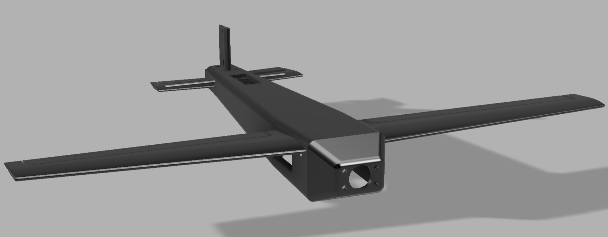
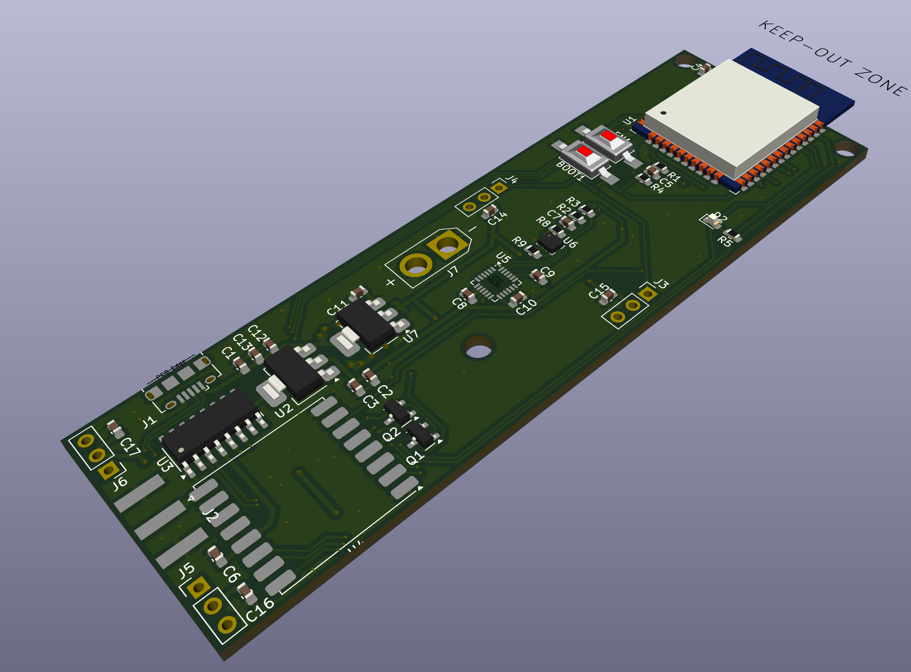
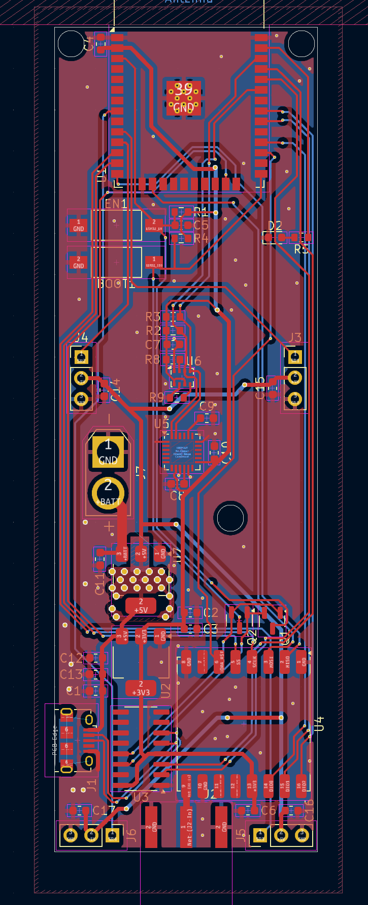
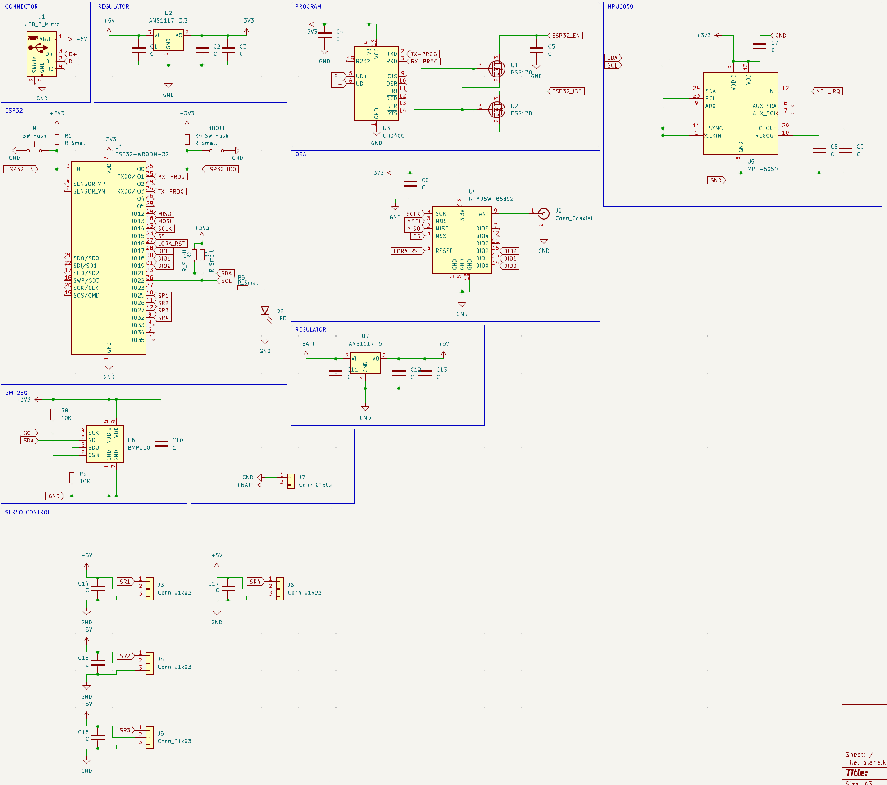

# PLANE  with 3D models and specific hardware control system 

* SG90 servo
* LD-POWER motor 4300KV
* ESC 8A 

### Thingiverse
[LINK](https://www.thingiverse.com/thing:6716661)

### 3d global view

## Hardware

* ESP32 wifi + bluetooth controller
* LORA 868mhz Long range communication
* 4 channels servos control
* XT30 battery connector
* MPU6050 giro and accel mcu
* BMP280 altimeter

### 3d view

### Pcb view
 

### Schematic view
